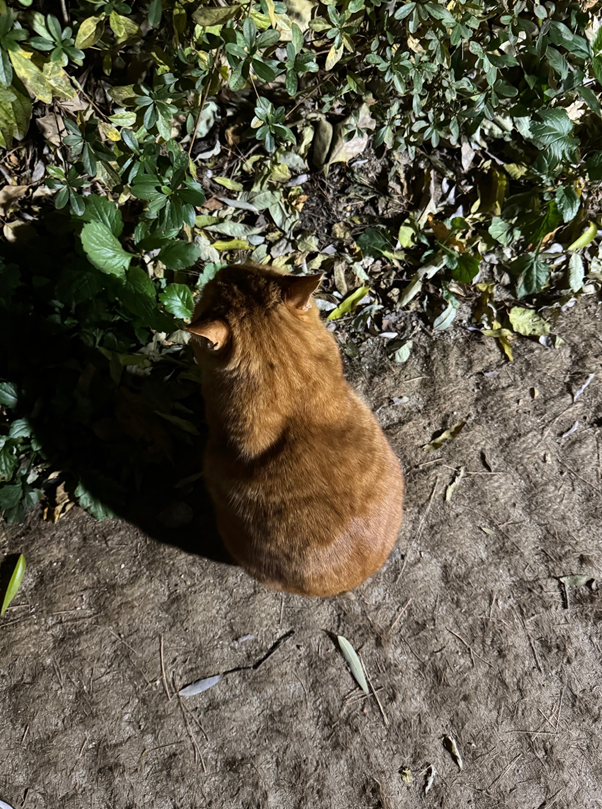

<!--
[](https://classroom.github.com/a/gFPznrUY)
# Welcome to GitHub

캡스톤 팀 생성을 축하합니다.

## 팀소개 및 페이지를 꾸며주세요.

- 프로젝트 소개
  - 프로젝트 설치방법 및 데모, 사용방법, 프리뷰등을 readme.md에 작성.
  - Api나 사용방법등 내용이 많을경우 wiki에 꾸미고 링크 추가.

- 팀페이지 꾸미기
  - 프로젝트 소개 및 팀원 소개
  - index.md 예시보고 수정.

- GitHub Pages 리파지토리 Settings > Options > GitHub Pages 
  - Source를 marster branch
  - Theme Chooser에서 태마선택
  - 수정후 팀페이지 확인하여 점검.

**팀페이지 주소** -> https://kookmin-sw.github.io/ '{{자신의 리파지토리 아이디}}'

**예시)** 2023년 0조  https://kookmin-sw.github.io/capstone-2023-00/


## 내용에 아래와 같은 내용들을 추가하세요.
-->

### 1. 프로잭트 소개

프로젝트

### 2. 소개 영상

프로젝트 소개하는 영상을 추가하세요

---

# 🎮 팀원 소개

---

### 🌟 임상학
<table>
  <tr>
    <td width="120">
      
    </td>
    <td>
      <strong>학번</strong> : 20181251 <hr>
      <strong>역할</strong> : 개발 <hr>
      <strong>이력</strong>:  
      <br>&nbsp;&nbsp;&nbsp;&nbsp;- 유니티 및 자체 엔진 제작 경험<hr>
      <strong>연락처</strong>:  
      <br>&nbsp;&nbsp;&nbsp;&nbsp;- 📧 Email: <a href="mailto:09lsh16@kookmin.ac.kr">09lsh16@kookmin.ac.kr</a>  
      <br>&nbsp;&nbsp;&nbsp;&nbsp;- 💻 GitHub: <a href="https://github.com/Will-Big">GitHub 페이지</a>  
    </td>
  </tr>
</table>

---

### 🎯 윤진호
<table>
  <tr>
    <td width="120">
      
    </td>
    <td>
      <strong>학번</strong> : 20222169 <hr>
      <strong>역할</strong> : 기획 <hr>
      <strong>이력</strong>:  
      <br>&nbsp;&nbsp;&nbsp;&nbsp;- 2022 CES 2023 AVALVE  
      <br>&nbsp;&nbsp;&nbsp;&nbsp;- 2023 KBO ESG 아이디어 경진 프로젝트 - 장려상  
      <br>&nbsp;&nbsp;&nbsp;&nbsp;- 2023 - 2024 몬스터 에너지 행사 기획 및 협찬  
      <br>&nbsp;&nbsp;&nbsp;&nbsp;- 2024 - sekisui house 미래 사업 프로젝트  
      <br>&nbsp;&nbsp;&nbsp;&nbsp;- 2024 - 2025 ASML KOREA<hr>
      <strong>연락처</strong>:  
      <br>&nbsp;&nbsp;&nbsp;&nbsp;- 📧 Email: <a href="mailto:yjh@example.com">yjh@example.com</a>  
      <br>&nbsp;&nbsp;&nbsp;&nbsp;- 💻 GitHub: <a href="https://github.com/yjhplanner">GitHub 페이지</a>  
    </td>
  </tr>
</table>

---

### 🕹️ 조영서
<table>
  <tr>
    <td width="120">
      
    </td>
    <td>
      <strong>학번</strong> : 20191671 <hr>
      <strong>역할</strong> : 개발 <hr>
      <strong>이력</strong>:  
      <br>&nbsp;&nbsp;&nbsp;&nbsp;- Google Play 출시작 : 운빨 대장장이, 우지끈 낚시꾼  
      <br>&nbsp;&nbsp;&nbsp;&nbsp;- 대외 전시 출품 : BIC, G-STAR, 타이페이 게임쇼 (전시작 DENEV)  <hr>
      <strong>연락처</strong>:  
      <br>&nbsp;&nbsp;&nbsp;&nbsp;- 📧 Email: <a href="mailto:jysa000@naver.com">jysa000@naver.com</a>  
      <br>&nbsp;&nbsp;&nbsp;&nbsp;- 💻 GitHub: <a href="https://github.com/jysa000">GitHub 페이지</a>  
      <br>&nbsp;&nbsp;&nbsp;&nbsp;- 🎮 Google Play: <a href="https://play.google.com/store/apps/dev?id=7689537255558713422&pli=1">Google Play 개발자 페이지</a>  
    </td>
  </tr>
</table>


---

이 페이지는 졸업작품 개발에 참여하는 팀원들을 소개하는 페이지입니다. 🎮✨

### 4. 사용법

소스코드제출시 설치법이나 사용법을 작성하세요.

### 5. 기타

추가적인 내용은 자유롭게 작성하세요.


## Markdown을 사용하여 내용꾸미기

Markdown은 작문을 스타일링하기위한 가볍고 사용하기 쉬운 구문입니다. 여기에는 다음을위한 규칙이 포함됩니다.

```markdown
Syntax highlighted code block

# Header 1
## Header 2
### Header 3

- Bulleted
- List

1. Numbered
2. List

**Bold** and _Italic_ and `Code` text

[Link](url) and 
```

자세한 내용은 [GitHub Flavored Markdown](https://guides.github.com/features/mastering-markdown/).

### Support or Contact

readme 파일 생성에 추가적인 도움이 필요하면 [도움말](https://help.github.com/articles/about-readmes/) 이나 [contact support](https://github.com/contact) 을 이용하세요.
